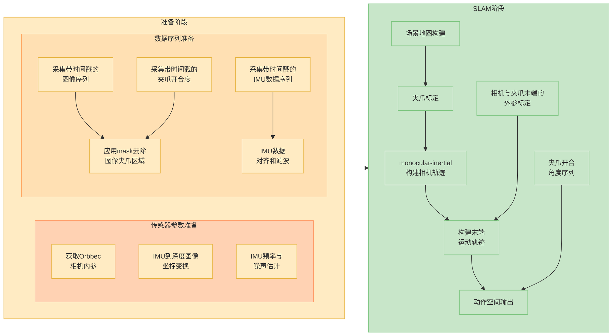

```mermaid
%%{init: {'theme': 'default', 'themeVariables': { 'fontSize': '16px', 'fontFamily': 'arial' }, 'flowchart': { 'useMaxWidth': false, 'htmlLabels': true }, 'securityLevel': 'loose'}}%%

graph LR
    %% 主要流程连接
    准备阶段 --> SLAM阶段
    
    %% 准备阶段子图
    subgraph 准备阶段
        direction LR
        
        subgraph 传感器参数准备["传感器参数准备"]
            direction TB
            A11["获取Orbbec<br>相机内参"]
            A12["IMU到深度图像<br>坐标变换"]
            A13["IMU频率与<br>噪声估计"]
        end
        
        subgraph 数据序列准备["数据序列准备"]
            direction TB
            
            %% 图像序列准备
            A21["采集带时间戳的<br>图像序列"] --> A22["应用mask去除<br>图像夹爪区域"]
            
            %% IMU序列准备
            A41["采集带时间戳的<br>IMU数据序列"] --> A42["IMU数据<br>对齐和滤波"]
            
            %% 夹爪序列准备
            A31["采集带时间戳的<br>夹爪开合度"] --> A22
        end
    end
    
    %% SLAM阶段子图
    subgraph SLAM阶段
        direction TB
        C11["场景地图构建"] --> C12["夹爪标定"] --> C13["monocular-inertial<br>构建相机轨迹"] --> C14["构建末端<br>运动轨迹"] --> C15["动作空间输出"]
        C21["相机与夹爪末端的<br>外参标定"] ---> C14
        C32["夹爪开合<br>角度序列"] ---> C15
    end
    
    %% 样式设置 - 使用更和谐的颜色
    classDef preparation fill:#FFEBC3,stroke:#E8B647,stroke-width:1px,font-size:14px,color:#333
    classDef execution fill:#C8E6C9,stroke:#81C784,stroke-width:1px,font-size:14px,color:#333
    classDef submodule1 fill:#FFD2B3,stroke:#FF9966,stroke-width:1px,font-size:14px,color:#333
    classDef submodule2 fill:#FFE0B3,stroke:#FFAA66,stroke-width:1px,font-size:14px,color:#333
    
    class 准备阶段 preparation
    class 传感器参数准备 submodule1
    class 数据序列准备 submodule2
    class A11,A12,A13,A21,A22,A31,A41,A42 preparation
    
    class SLAM阶段 execution
    class C11,C12,C13,C14,C15,C21,C32 execution
``` 